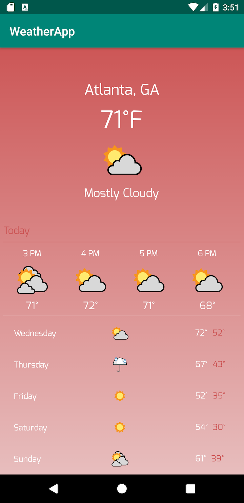
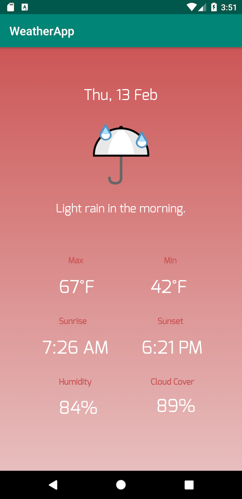

# training_sample

A siimple weather android application that displays current, hourly, daily forecasting, implemented in Kotlin.

### Built With
[Android Studio](https://developer.android.com/studio) - The app framework used

[Retrofit](https://square.github.io/retrofit/) - REST API

[MockK](https://mockk.io/) - Unit test 

### Screenshots

